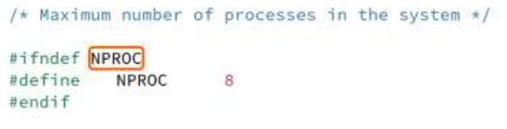
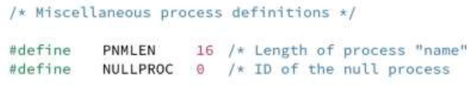
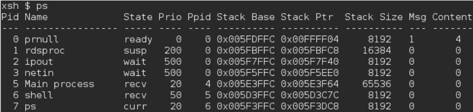
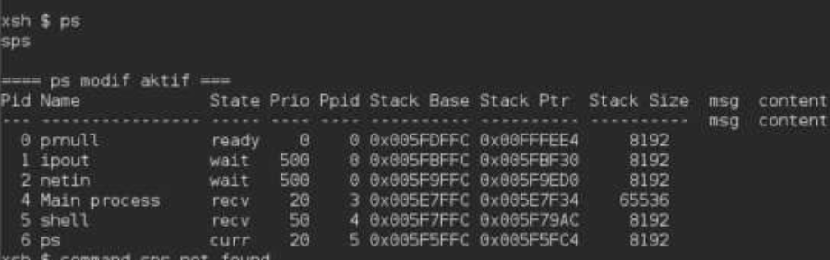
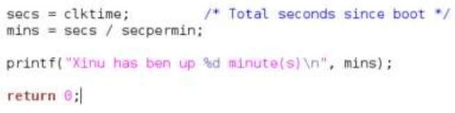

<h1 align="center">Laporan Praktikum Modul 05   Eksplorasi Proses Xinu</h1>

 Muhammad Mahrus Ali – NIM 2311104006 

# Tujuan

1. Mahasiswa memahami **Process Control Block (PCB)** pada Xinu.  
2. Mahasiswa mampu melakukan **modifikasi sederhana pada process**.

---

# Catatan

1. Praktikan wajib untuk **screenshot setiap langkah yang dikerjakan hingga tampilan output akhir**.  
2. Untuk soal **source code, kumpulkan screenshot-nya saja**.  
3. Praktikan wajib melakukan **screenshot lengkap dengan nama root**.Contoh:root@username.
4. Berikan **identitas nama dan NIM dalam bentuk comment di Source Code**.  
5. Harap kerjakan **secara mandiri**. Jika tidak paham silahkan bertanya kepada Asisten Praktikum masing-masing.  
6. **Dilarang mengcopy jawaban dan source code dari teman.**

---

# Jurnal

## 1. [10 Poin] Jawablah pertanyaan berikut ini

### a. Berapa banyaknya maksimum proses yang ada pada Xinu?

**Jawab:**  
8

### b. Berapa maksimal panjang nama suatu proses pada Xinu?

**Jawab:**  
16

### c. Berapa nilai prioritas awal pada saat proses dibuat?

**Jawab:**  
20

### d. Ada berapa total state pada Xinu? Sebutkan!

**Jawab:**  
8

# 2. [20 Poin]

Perintah **ps** adalah perintah untuk menampilkan **statistik process yang berjalan**.  
Source code dari ps tersimpan pada file xsh_ps.c. Carilah file tersebut dan **beri komentar pada 20 baris terakhir di source code tersebut.**

**Jawab:**

# 3. [35 Poin]

Ubahlah perintah **ps** (source code: `xsh_ps.c`) pada Xinu sehingga menampilkan **informasi tambahan berupa kolom yang berisi total message yang ada pada proses** seperti gambar dibawah ini:

Keterangan:
- **Kolom Msg** → banyaknya pesan yang ada dalam proses  
- **Kolom Content** → isi dari pesan tersebut

## Langkah Pengerjaan

- Modifikasi source code pada file **xsh_ps.c**
- Kompilasi ulang Xinu dengan perintah seperti pada modul sebelumnya
- Jalankan **Backend VM**
- Setelah sistem berjalan, jalankan perintah: $ps. Pastikan hasilnya sesuai dengan contoh output pada gambar yang diberikan.
- Screenshot source kode dan output akhir hasil modifikasi

**Jawab:**

## Source code:

## Output:

# 4. [35 Poin]

Ubahlah perintah **uptime** pada Xinu sehingga menampilkan lamanya Xinu sejak booting **hanya dalam satuan menit**.

## Langkah Pengerjaan

- Modifikasi source code pada file **xsh_uptime.c**
- Kompilasi ulang Xinu dengan perintah seperti pada modul sebelumnya
- Jalankan **Backend VM**
- Setelah sistem berjalan, jalankan perintah: $uptime. Pastikan hasilnya sesuai dengan contoh output yang diinginkan
- Screenshot source kode dan output akhir hasil modifikasi

**Jawab:**

## Source code:

## Output:

