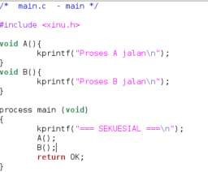
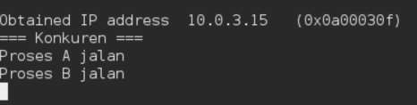
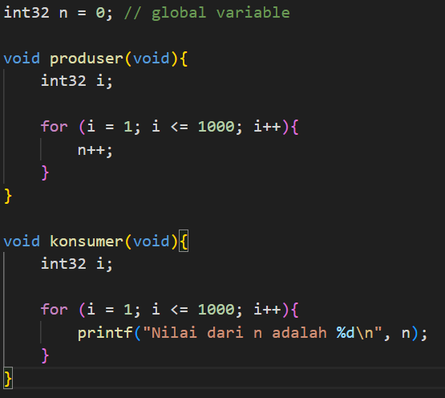
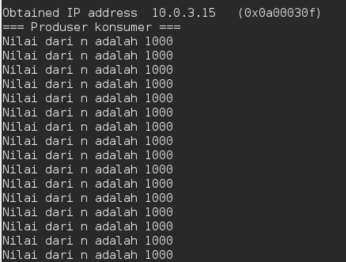

<h1 align="center">Laporan Praktikum Modul 06   Proses Sekuensial dan Konkuren</h1>

 Muhammad Mahrus Ali – NIM 2311104006 

# Tujuan

1. Mahasiswa mampu membuat proses berjalan secara **sekuensial**.  
2. Mahasiswa mampu membuat proses berjalan secara **konkuren**.

---

# Catatan

1. Praktikan wajib untuk **screenshot setiap langkah yang dikerjakan hingga tampilan output akhir**.  
2. Untuk soal **source code, kumpulkan screenshot-nya saja**.  
3. Praktikan wajib melakukan **screenshot lengkap dengan nama root**.Contoh: root@username.
4. Berikan **identitas nama dan NIM dalam bentuk comment di Source Code**.  
5. Harap kerjakan **secara mandiri**. Jika tidak paham silahkan bertanya kepada Asisten Praktikum masing-masing.  
6. **Dilarang mengcopy jawaban dan source code dari teman.**

---

# Jurnal

## 1. [10 Poin]

Selain hardware (memory), batasan maksimal proses dapat ditentukan secara **software**.  

Pada Linux maksimal proses adalah:

- **4194303 proses (64 bit)**  
- **32767 proses (32 bit)**  

Hal ini dapat dilihat melalui perintah: $cat/proc/sys/kernel/pid_max

Carilah pada **source code Xinu** yang memberi batasan mengenai banyaknya proses yang bisa dibuat.

- Berapa maksimal proses dalam Xinu?  
- Ubah menjadi maksimal **150 proses**.

### Jawab

Maksimal proses pada Xinu: **8 proses**

ubah menjadi: **150 proses**

---

## 2. [20 Poin]

Jalankan **kode sekuensial**.

### Source code

### Output

---

## 3. [20 Poin]

Jalankan **kode konkuren**.

### Source code

### Output

---

## 4. [50 Poin]

Buatlah **2 proses produser dan konsumer**.

- Produser memproduksi angka integer dari **1–1000**
- Konsumer mengkonsumsi integer yang diproduksi oleh produser dan menampilkannya

Gunakan **variabel global bertipe `int32` bernama `n`** yang digunakan bersama oleh kedua proses.

### Source Code

Hasil dari program ini cukup mengejutkan (tidak akan sesuai dengan intuisi awal). Jelaskan mengapa hasilnya seperti itu!

### Output:

## Penjelasan:

Hasil program tidak sesuai intuisi karena proses produser dan konsumer berjalan secara konkuren dan mengakses variabel global n secara bersama-sama tanpa sinkronisasi.
Akibatnya, konsumer dapat membaca nilai n pada kondisi yang berbeda-beda, baik sebelum, saat, maupun sesudah produser memodifikasi nilainya.
Fenomena ini disebut race condition.