# <h1 align="center">Laporan Praktikum Modul 09 <br> Syscall</h1>
<p align="center">Muhammad Mahrus Ali - 2311104006</p>

---

## Dasar Teori

Source code syscall pada Xinu secara khusus terletak di direktori ../system. Direktori ini berisi implementasi dari berbagai panggilan sistem yang memungkinkan program pengguna berinteraksi dengan kernel sistem operasi.

Berikut adalah penjelasan lebih lanjut mengenai opsi-opsi lain:

Opsi A:../system adalah jawaban yang benar karena direktori ini secara khusus menyimpan implementasi dari panggilan sistem (syscall) dalam Xinu.
Opsi B:../shell biasanya berisi kode yang berkaitan dengan shell Xinu, yaitu antarmuka baris perintah yang digunakan untuk berinteraksi dengan sistem operasi.
Opsi C:./include berisi file header yang mendefinisikan struktur data, konstanta, dan deklarasi fungsi yang digunakan di seluruh sistem operasi, tetapi bukan implementasi dari syscall.
Opsi D:./header bukan direktori standar dalam struktur Xinu.

---

## Guided

### 9.1 Implementasi Syscall pada Xinu

Berikut hasil tampilan saat Xinu berhasil dijalankan:

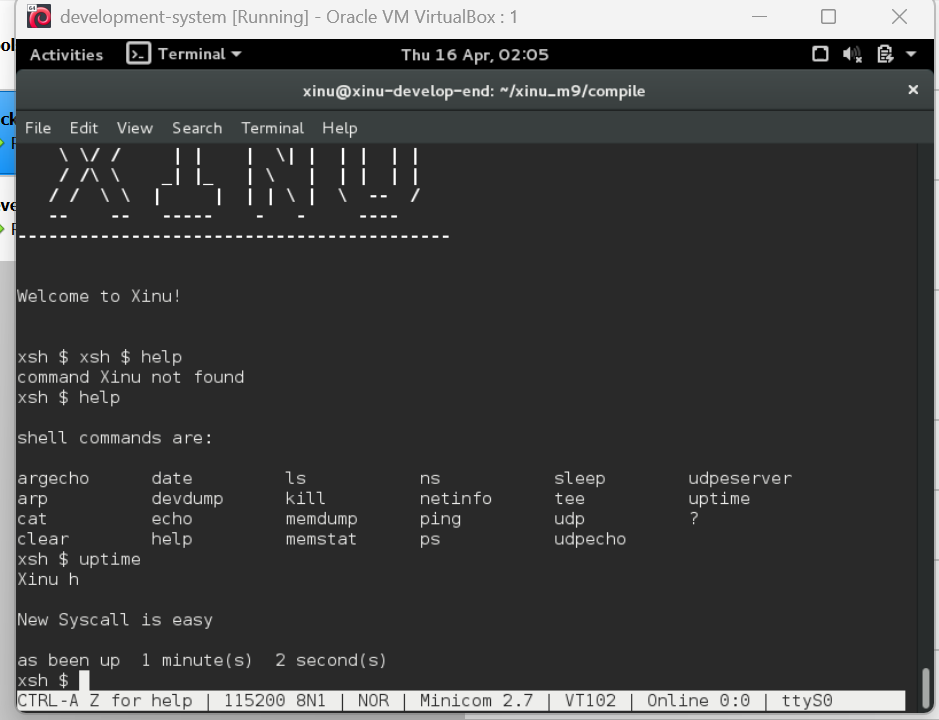

Terlihat bahwa sistem berhasil dijalankan dan perintah seperti help dan uptime dapat digunakan.

---


## Unguided

### Soal 1

**Penempatan Screenshot:**
- Screenshot kode → taruh setelah bagian kode
- Screenshot hasil run → taruh setelah penjelasan output

Kode syscall (file: `system/chname.c`):

```c
#include <xinu.h>

syscall chname(void) {
    intmask mask;
    mask = disable();

    kprintf("New Syscall is easy\n");

    restore(mask);
    return OK;
}
```

Tambahkan di file `include/prototypes.h`:

```c
extern syscall chname(void);
```

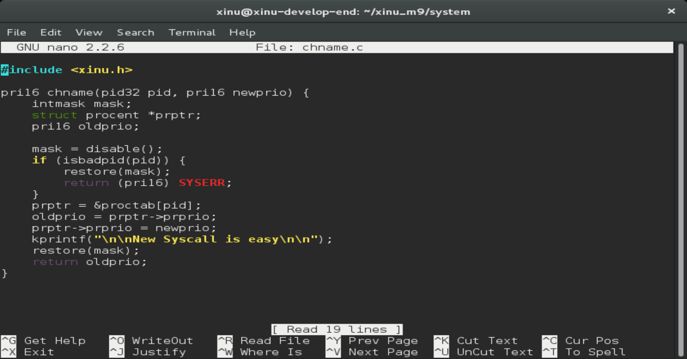

Langkah compile:

```bash
make clean
make
```

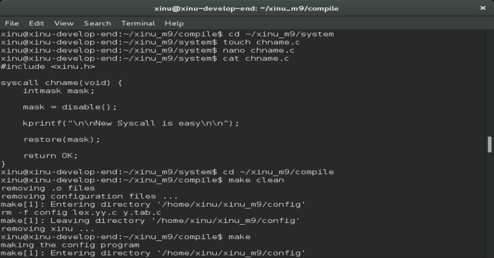

hasil output:

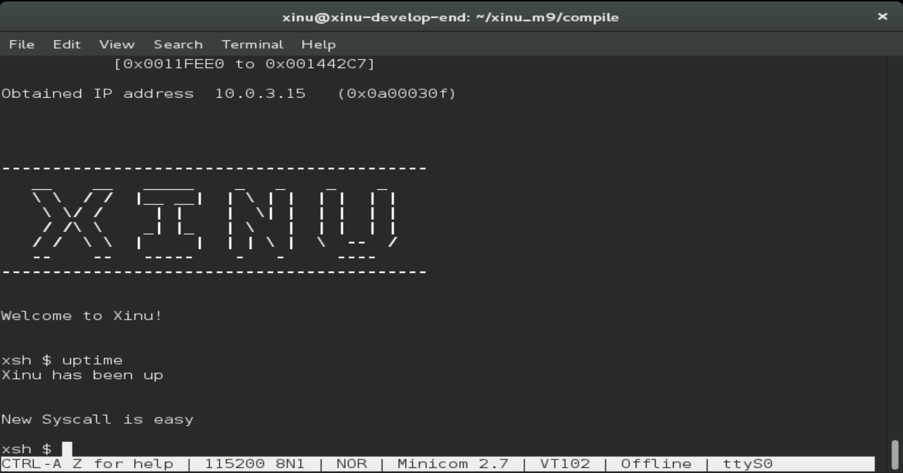

---

### Soal 2

**Penempatan Screenshot:**
- Screenshot kode `chprio.c` → setelah kode
- Screenshot hasil testing → setelah penjelasan

File: `system/chprio.c`

```c
syscall chprio(pid32 pid, pri16 newprio) {
    intmask mask;
    mask = disable();

    if (isbadpid(pid) || newprio <= 0) {
        restore(mask);
        return SYSERR;
    }

    struct procent *prptr;
    prptr = &proctab[pid];
    prptr->prprio = newprio;

    restore(mask);
    return newprio;
}
```

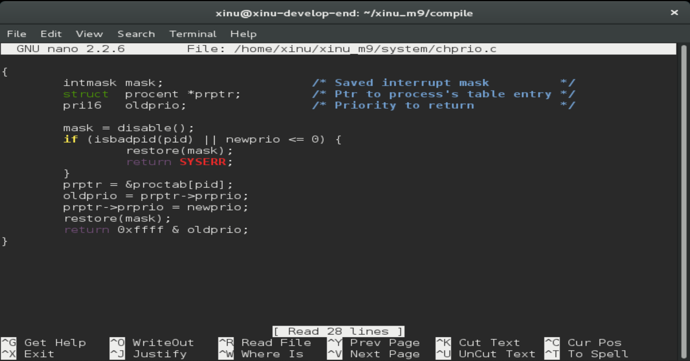

---

### Soal 3

**Penempatan Screenshot:**
- Screenshot sebelum `uptime` (ps pertama)
- Screenshot setelah `uptime` (ps kedua)

Edit file: `shell/xsh_uptime.c`

```c
chprio(5,33);
```

Perintah:

```bash
ps
uptime
ps
```

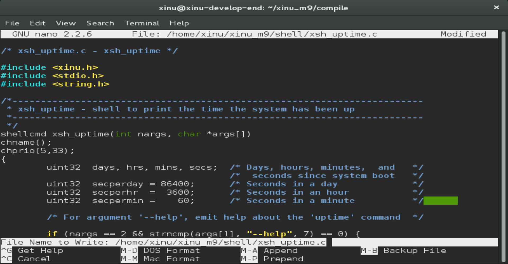

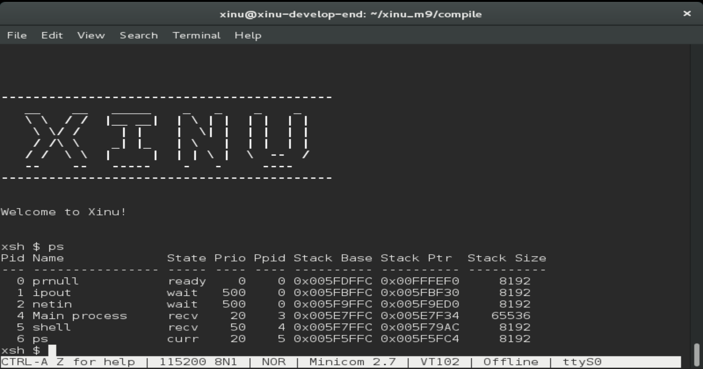

Screenshoot setelah uptime:

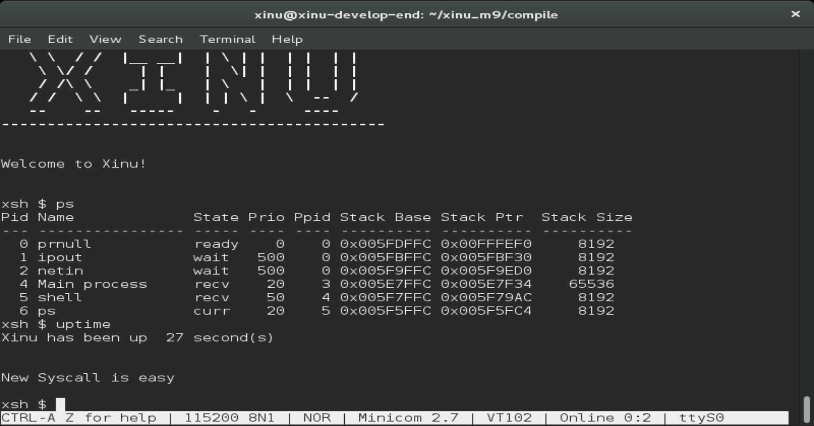

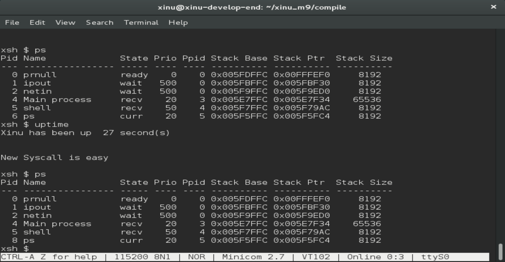

---

### Testing

#### 1. Prioritas negatif

```c
chprio(5,-3);
```


Output:

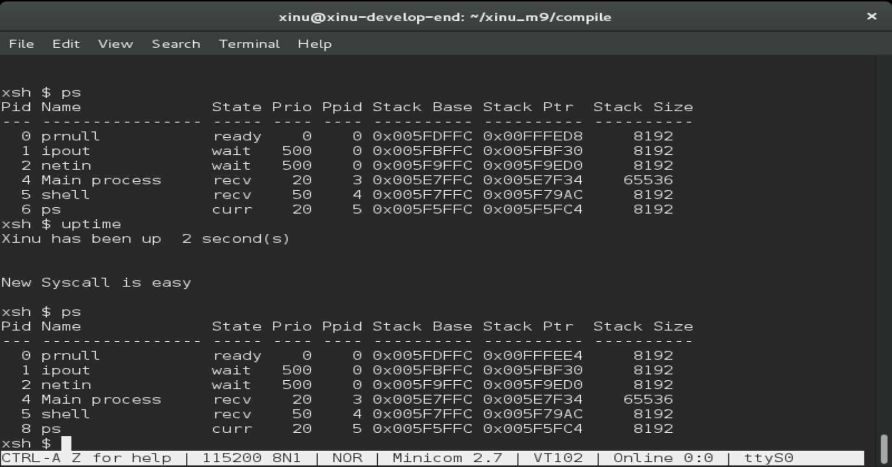

#### 2. PID tidak valid

```c
chprio(3000,3);
```
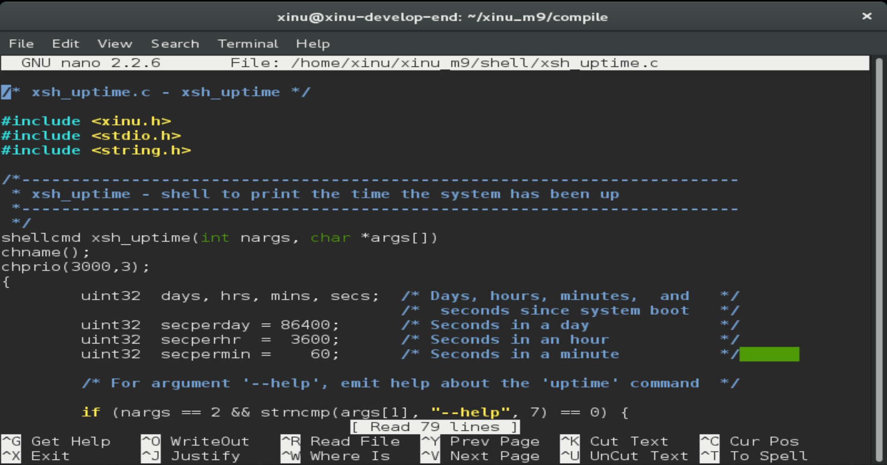

Output:

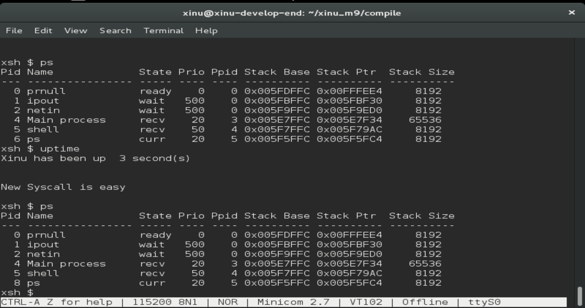

---

## Referensi

1. Modul Praktikum Sistem Operasi – Modul 9: Syscall
2. https://www.scribd.com/document/81001430/Xi-Nu-Man-0
3. https://www.dmi.unict.it/pappalardo/lab3/xinuman2.pdf
4. https://medium.com/@bezaliel/syscall-pada-xinu-0c5471f1752e