# <h1 align="center">Laporan Praktikum Modul 15 <br> Keamanan Linux</h1>

<p align="center">
Muhammad Mahrus Ali - 2311104006
</p>

---

## Catatan

* Screenshot setiap langkah hingga output akhir.
* Untuk soal source code cukup screenshot hasil.
* Cantumkan identitas nama dan NIM pada source code.

---

# 1. Integritas: Dasar Hashing

## a. Hash File `/etc/passwd`

Melakukan hashing menggunakan algoritma:

* SHA256
* SHA512
* MD5

### Screenshot

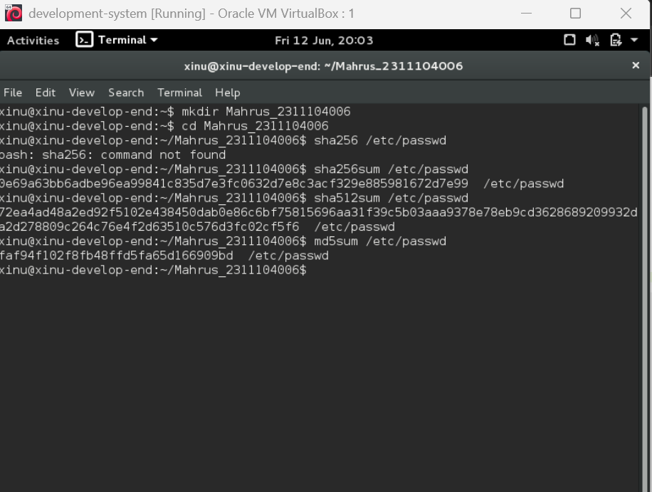

---

## b. Membuat File `test_0.txt`

Menyalin seluruh isi file `/etc/passwd` ke file `test_0.txt`.

### Screenshot

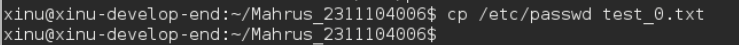

---

## c. Hash File `test_0.txt`

Melakukan hashing SHA256, SHA512, dan MD5 terhadap file `test_0.txt`.

### Screenshot

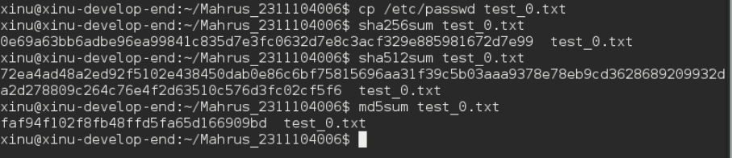

---

## d. Rename Menjadi `file_0.txt`

Rename file:

```bash
mv test_0.txt file_0.txt
```

Kemudian lakukan hashing kembali.

### Screenshot

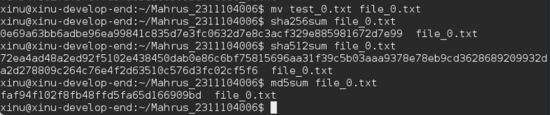

---

## e. Analisis

File `/etc/passwd`, `test_0.txt`, dan `file_0.txt` memiliki nilai hash yang sama karena isi file tidak berubah. Algoritma hashing hanya memperhatikan konten file, bukan nama file.

---

# 2. Integritas: Avalanche Effect

## a. Download File `test_1.txt`

### Screenshot

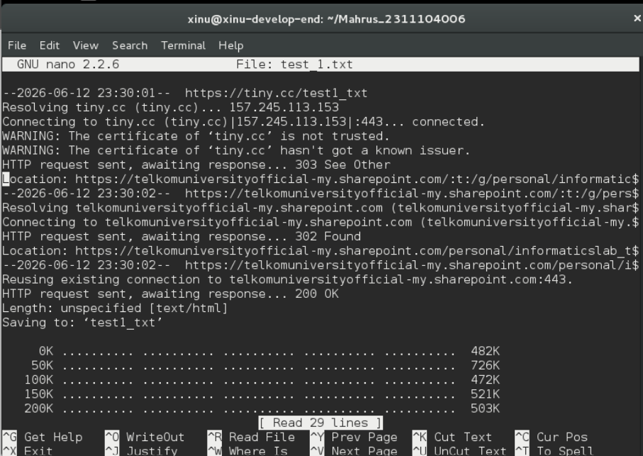

---

## b. Hash File `test_1.txt`

Melakukan hashing SHA256, SHA512, dan MD5.

### Screenshot

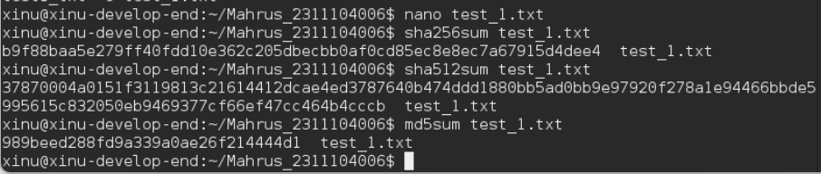

---

## c. Menghapus Karakter Titik

Menghapus satu karakter titik (`.`) pada akhir file kemudian menyimpan perubahan.

### Screenshot

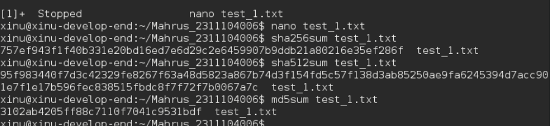

---

## d. Hash Ulang File

Melakukan hashing kembali setelah modifikasi.

### Screenshot


---

## e. Analisis

Nilai hash berubah secara drastis walaupun hanya satu karakter yang dihapus. Fenomena ini disebut **Avalanche Effect**, yaitu perubahan kecil pada input menghasilkan perubahan besar pada output hash.

---

# 3. Integritas: Metadata

## a. Download File `test_1.doc`

### Screenshot

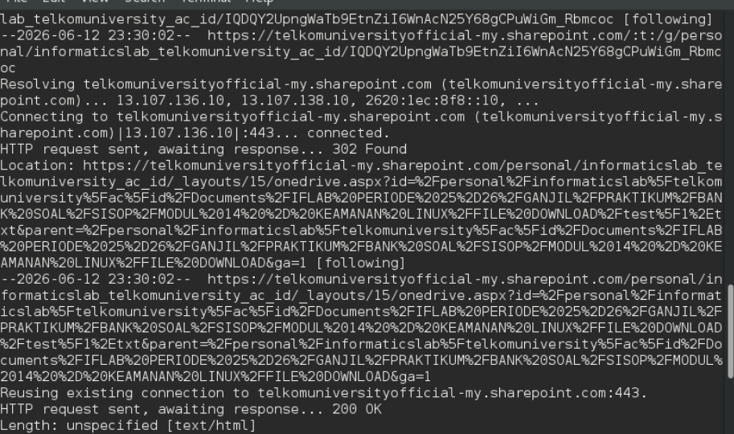

---

## b. Hash Awal File

Melakukan hashing SHA256, SHA512, dan MD5.

### Screenshot

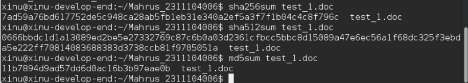

---

## c. Modifikasi Dokumen

### i. Menambahkan Teks

Tambahkan teks:

```text
abcdef
```

Kemudian simpan file.

### Screenshot

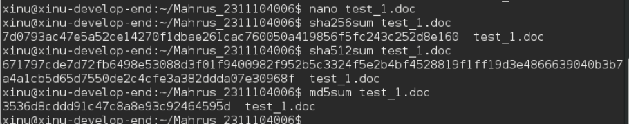

---

### ii. Menghapus Teks

Hapus kembali teks tersebut lalu simpan.

### Screenshot


---

## d. Hash Akhir File

Melakukan hashing kembali setelah proses save.

### Screenshot


---

## e. Analisis

Nilai hash berubah walaupun isi dokumen kembali seperti semula. Hal ini disebabkan oleh perubahan metadata file seperti timestamp modifikasi dan informasi revisi dokumen.

---

# 4. Konfidensialitas: EncFS

## a. Instalasi EncFS

```bash
sudo apt-get update
sudo apt-get -y install encfs
```

Membuat folder terenkripsi:

```bash
encfs ~/folder_anda/folder_terenkripsi ~/folder_anda/folder_normal
```

### Screenshot

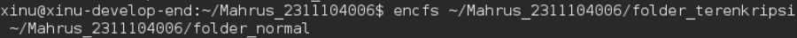

---

## b. Menyalin File ke Folder Normal

Menyalin beberapa file ke folder normal.

### Screenshot

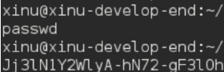

### Observasi

Pada folder terenkripsi muncul file dengan nama dan isi yang telah dienkripsi.

---

## c. Menghapus File pada Folder Terenkripsi

### Screenshot

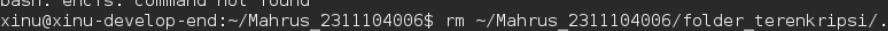

---

### Screenshot

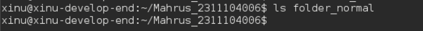

### Observasi

File pada folder normal ikut terhapus karena kedua folder saling terhubung.

---

## d. Unmount Folder

```bash
fusermount -u ~/folder_anda/folder_normal
```

### Screenshot

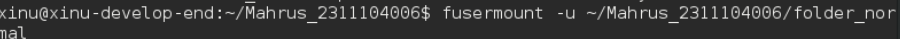

### Observasi

Folder normal menjadi kosong, sedangkan file terenkripsi tetap tersimpan.

---

## e. Mount Ulang Folder

```bash
encfs ~/folder_anda/folder_terenkripsi ~/folder_anda/folder_sembarang
```

### Screenshot

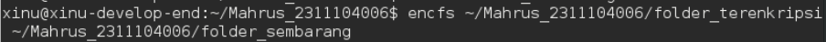

### Observasi

File dapat diakses kembali setelah dilakukan mount menggunakan password yang benar.

---

# 5. Konfidensialitas: GPG

## a. Membuat Public dan Private Key

```bash
gpg --gen-key
```

### Screenshot

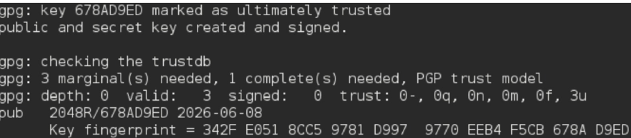

---

## b. Menampilkan Daftar Key

```bash
gpg --list-keys
gpg --fingerprint email@example.com
```

### Screenshot

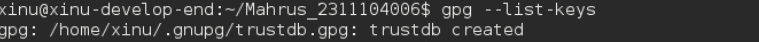

---
### Screenshot

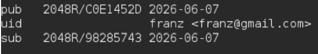

---
## c. Export Public Key

```bash
gpg --armor --export email@example.com > mypublic_key.asc
```

Rename file:

```bash
mv mypublic_key.asc 2311104006.asc
```

### Screenshot

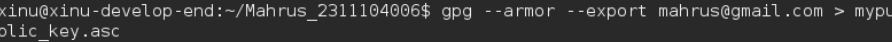

---
### Screenshot

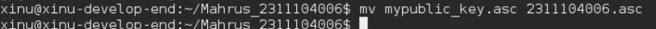

---

## d. Import Public Key Teman

```bash
gpg --import nim_teman.asc
```

Verifikasi:

```bash
gpg --list-keys
```

### Screenshot

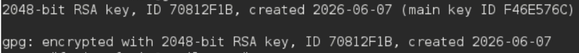

---

## e. Enkripsi Pesan

Buat file:

```text
file_rahasia.txt
```

Lakukan enkripsi:

```bash
gpg --encrypt --armor -r email_teman@example.com file_rahasia.txt
```

### Screenshot

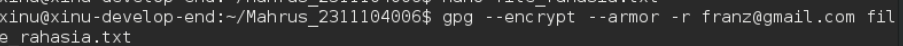

---

## f. Dekripsi Pesan

```bash
gpg file_rahasia_nim_anda.asc
```

### Screenshot


---

# Kesimpulan

Pada praktikum ini dipelajari penerapan aspek keamanan informasi yang meliputi integritas dan konfidensialitas data. Integritas diuji menggunakan fungsi hash, Avalanche Effect, serta metadata file. Konfidensialitas diterapkan menggunakan EncFS untuk enkripsi file system dan GPG untuk komunikasi aman menggunakan pasangan public key dan private key.

---

## Struktur Folder Repository

```text
.
├── README.md
└── assets
    ├── hash_etc_passwd.png
    ├── copy_passwd.png
    ├── hash_test0.png
    ├── hash_file0.png
    ├── download_test1.png
    ├── hash_test1_awal.png
    ├── hash_test1_akhir.png
    ├── download_test1_doc.png
    ├── hash_doc_awal.png
    ├── hash_doc_akhir.png
    ├── setup_encfs.png
    ├── copy_encfs.png
    ├── delete_encfs.png
    ├── unmount_encfs.png
    ├── remount_encfs.png
    ├── gen_key.png
    ├── list_keys.png
    ├── export_key.png
    ├── import_key.png
    ├── encrypt_file.png
    └── decrypt_file.png
```
